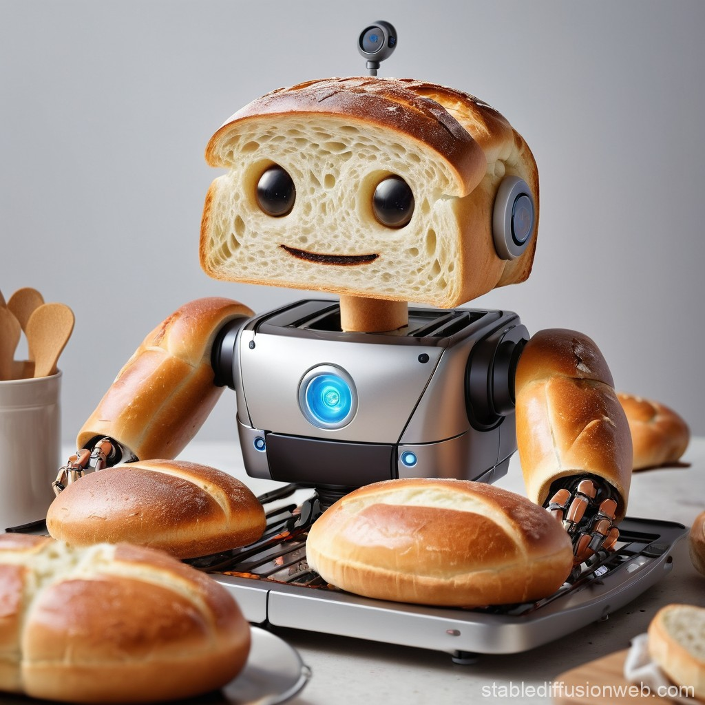

# SteamBread Robotics


SteamBread Robotics is an **extensible**, **modular**, **integrated** framework for general robot manipulation. This project aims to provide a flexible and powerful toolkit for developing and deploying robotic manipulation solutions in various environments.

## Features

- Modular architecture for easy extension and customization
- Geometric constraint-based manipulation planning
- Environment modeling and interaction
- Integration with various perception systems (e.g., RealSense cameras)
- Visualization tools for debugging and monitoring
- Adaptable to different robotic platforms and environments

## Installation

```
git clone https://github.com/CUHKWilliam/SteamBread-Robotics.git
cd SteamBread-Robotics
pip install -r requirements.txt
```